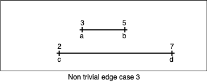

# Quality Assurance

[](https://sonarcloud.io/dashboard?id=adam-rocska_shipping-tier)

# Problem Statement

Given a set of time intervals in the form of (min, max) with unknown standard deviation, select the one interval, that's the fastest, with the highest probability of arriving the soonest.

# Decomposition

For any comparison, we compare two intervals.  
Let them be `A` and `B`.
Let's name their individual limit values as follows :

`a = A.min` where `A.min` represents `A`'s minimum time.  
`b = A.max` where `A.max` represents `A`'s maximum time.  
`c = B.min` where `B.min` represents `B`'s minimum time.  
`d = B.max` where `B.max` represents `B`'s maximum time.  

The values can be expressed on a 1 dimensional line / axis as two individual line segments.


We know the following relationship between these values :  
`b > a`  
`d > c`  

# Non-Trivial Edge Cases

When comparing two intervals, the decision regarding which one is "faster" with the highest probability is not trivial.   
Observe the following examples as edge cases, where :  
`{a, b, c, d} ∈ {1, 2, 3, 4, 5, 6, 7}`

1. `a = 3, b = 5, c = 2, d = 6` : In this case, the interval `[a,b]` should be considered "faster", since even though `c < a`, the likelihood of `[a,b]` arriving sooner than `[c,d]` is greater.
2. `a = 3, b = 5, c = 1, d = 6` : In this case, the interval `[c,d]` should be considered "faster", since its min time `c` is smaller than `a`, and the overall probability of it arriving sooner than `[a,b]` is higher.
3. `a = 3, b = 5, c = 2, d = 7` : In this case, the interval `[a,b]` should be considered "faster", since the likelihood of it arriving faster than `[c,d]` is decisively greater.

## Illustrations

  
_Non-Trivial Edge Case 1_  
  
_Non-Trivial Edge Case 2_  
  
_Non-Trivial Edge Case 3_  

# Ruling out solutions

One naive, yet intuitive solution is to just calculate the median of the intervals in comparison, and compare those two values.  
If `median(A) < median(B)`, then `A` is faster, otherwise `B`.

While it's a simple idea, it can lead to wrong results.  
Observe the following example:  
```
a = 4
b = 14
c = 8
d = 10
```

In this case, the interval `[a,b]` should be considered the fastest. However, based on purely median comparison, these two intervals would yield `9` as their median. To resolve this contradiction we could default to picking either the left or the right side of the operation. But either approach wouldn't guarantee good results.  
We could extend our logic, with first checking whether the medians are equal.  
**If they are** let's compare their minimum time.  
**Otherwise** do the previous logic.

In this case, with the following values :  
```
a = 4
b = 14
c = 3
d = 15
```
we would yield the interval `[c,d]` as faster, since their medians are equal, and `c < a`. But in this case, we lose the likelihood out of sight:  
It is more likely, that the interval `[a,b]` arrives faster, than `[c,d]`

We could probably construct a complex **truth table**, but that would introduce a lot of undesired :
* **cognitive complexity**, meaning, it would would be harder for humans to comprehend the "business logic",
* **cyclomatic complexity**, meaning, it would be harder to implement tests for all edge cases.

Therefore, given : 
* the complexity of the problem, 
* the sensitivity/importance of the logic behaving correctly, and
* the challenging empirical testability
it seems like the most optimal solution is one, that's based on a mathematical observation, rather than hard-coded logic.

# Ideas for mathematically correct possible solutions

1. Transforming it into a vector problem, where we have 2 vectors `A(a,b)` and `B(c,d)`
2. Derivative of the previous one : transforming it into a 2x2 matrix transformation problem, and start researching from the perspective of matrix determinants, as they are scalar elements encoding certain properties of a matrix transformation
3. Transforming it into a polar coordinate based vector computation
4. **Transforming it into an elementary geometric problem.**

The chosen solution is **Transforming it into an elementary geometric problem.**, with the assumption, that this document, and the code at hand may be interpreted by mathematically less adept php scripters, and the goal is to construct a mathematically correct, elegant, yet understandable solution which people of elementary knowledge are also able to comprehend, and work with.

# Chosen Solution

If we approach it visually, as we would determine the right shipping time as human beings, we would do the following :  
Line up the two `line segments` under one another, with respect to their ratios (as on the illustrations), and visually observe if we have a line segment that's more leftward than the other (this leads to observing the one with the smaller minimum time). Then we would observe its other end (the maximum time), and we would make sure, that the maximum time of the observed "faster" line-segment is more inward to the left direction, than how outward the leftmost edge is. This logic would ensure, that the probability tilts to "faster shipping time".
 
Illustrating visually what the intuitive human observer would do :
  
_Is c  farther to the left than a? Is d closer to the middle, than c?_

# Transforming it into a mathematical problem

Technically the answer to the two questions is nothing more, than the observation of the following angles :
```
cab = ?°
abd = ?°
```
But, we are talking about two **line segments** on a **1 dimensional line / axis**.  
So, first we will need to transform it into a 2 dimensional representation.  
As any other similar dimensional escalations, in similar contexts, this can be done with the use of a circle, who's radius `r` equals `[a,b]` (or `[c,d]`, it doesn't matter), and drawing a straight line by the radius, where the angle would be 90 degrees with either `a`, or `b`.  
For example :  
  
_Construction fo a 2 dimensional space_

Now, that we hacve a 2 dimensional reconstruction of our 1 dimensional problem, we just need to figure out how to tell the angles `cab` and `abd`.  
As a **WANTED "SIDE-EFFECT"** of using `[a,b]` as a radius, we are able to simplify our comparison logic.  
We will need to introduce two "helper line segments" and "helper values" : 
```
a' = a of A on line B
b' = b' of A on line B
t  = [a',c] = a' - c
s  = [b',d] = b' - d
```

  
_"Helper line segments" t, and s_

# Arctan2 as THE solution

Line segments `t` and `s` are actually vectors, as their direction / the order of the equation matters.  
```
t = a - c
s = b - d
```

Given the values we have defined so far, the problem can be rephrased as : 

* Is the angle of `caa'` to the right, or to the left of the `r` line casted from `a`?  
Or in yet another words, given a Cartesian coordinate system of `[a,b]` as its `y` axis, and `[a,a']` as its x axis, does the vector `ca` point in `quadrant III` _[misc. link : what are quadrants?](https://en.wikipedia.org/wiki/Cartesian_coordinate_system#Quadrants_and_octants)_
   * **If No** : interval `B` can't be faster, so `A` is considered to be faster.
   * **If Yes** :  
   Is the angle of `db'b` smaller, than the angle of `caa'`?    
   In other words, is it "more inward", than `c` is?  
   In other words : since `B`'s minimum time is faster than of `A`, is the probability of it arriving faster than `A` high enough?
   
Our equation works with the function [atan2(y,x)](https://en.wikipedia.org/wiki/Atan2).  
>The single-argument arctangent function cannot distinguish between diametrically opposite directions. For example, the anticlockwise angle from the x-axis to the vector (1, 1), calculated in the usual way as arctan(1/1), is π/4 (radians), or 45°. However, the angle between the x-axis and the vector (−1, −1) appears, by the same method, to be arctan(−1/−1), again π/4, even though one might expect the answers −3π/4, or 5π/4, −135° or 225°. In addition, an attempt to find the angle between the x-axis and the vectors (0, y), y ≠ 0 requires evaluation of arctan(y/0), which fails on division by zero.
>
>The atan2 function calculates one unique arc tangent value from two variables y and x, where the signs of both arguments are used to determine the quadrant of the result, thereby selecting the desired branch of the arc tangent of y/x, e.g., atan2 (1, 1) = π/4 and atan2 (−1, −1) = −3π/4. Similarly, e.g., atan2 (1, 0 )= π/2.  
_[Source : https://en.wikipedia.org/wiki/Atan2](https://en.wikipedia.org/wiki/Atan2)_
  
Our equation works with the following variables :   
```
A = a comparable interval
B = a comparable interval compared against A
a = minimum time of A
b = maximum time of A
c = minimum time of B
d = maximum time of B
r = b - a
t = a - c
s = d - b

minAngle = atan2(t, r) * (180 / π)
maxAngle = atan2(s, r) * (180 / π)
```

And the logic is : 
```
minAngle > 0° && maxAngle < minAngle
```