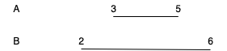

# Term Definitions

* `
` : A "P" type, where P represents the actual door to door transit time.
* `
 = {min ∈ ℕ, max ∈ ℕ}` : "P type" definition, where P has a "`min`" and a"`max`" property, both of which are members of the natural numbers set. `min` represents the minimum time the shipment would take, `max` represents the maximum time.  
* `
 ${NAME}` : A shipping method branch of name `${NAME}`
* `
 A` : Shipping method branch A in the comparison logic.
* `
 B` : Shipping method branch B in the comparison logic.
* `A.min` : **Minimum time** of shipping method branch **A**
* `A.max` : **Maximum time** of shipping method branch **A**

# Test Fixture Description

 

**Given** a set of shipping method branches  
**When** `A.min` is greater than `B.min`, **and** `A.max` is smaller than `B.max`  **and** `B.max` and `B.min` are of equal distance from `A.max` and `B.max`  
**Then** `
 A` is considered to be faster.
